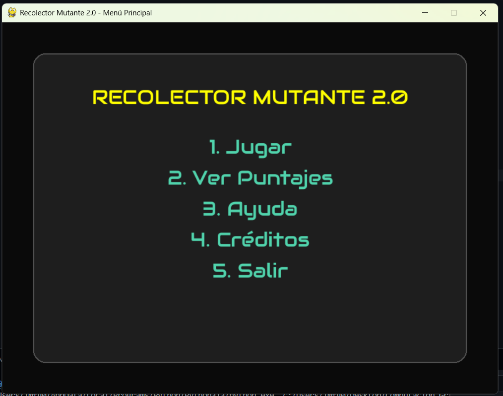
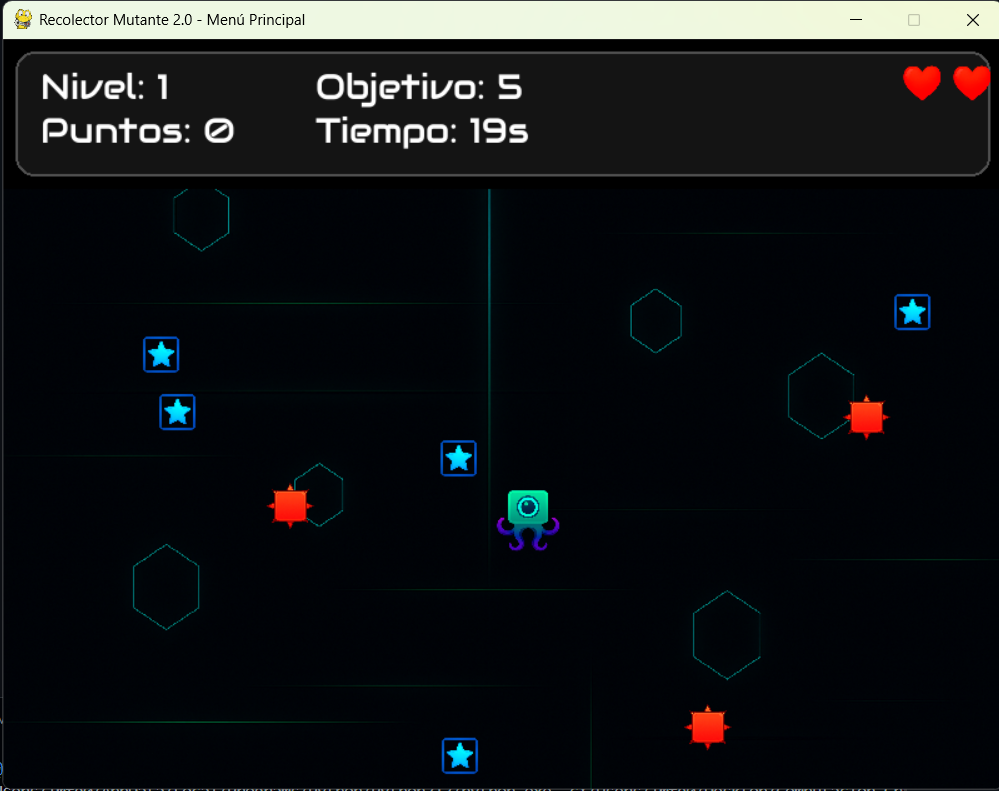
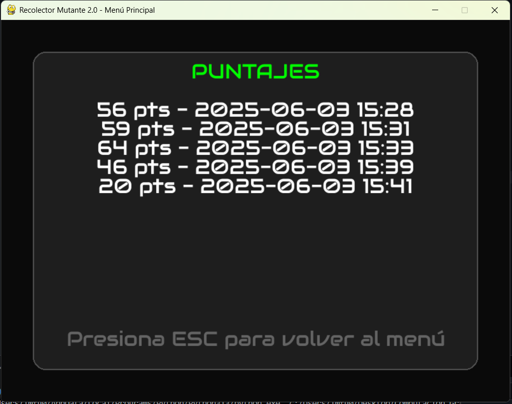

# 🧪 Recolector Mutante 2.0

> Proyecto académico - Computación Gráfica  
> Universidad Tecnológica de Pereira  
> Docente: Francisco Alejandro Medina Aguirre

---

## 🎮 Descripción

**Recolector Mutante 2.0** es un videojuego tipo arcade desarrollado con **Python y Pygame**.  
El objetivo es controlar a un recolector mutante que debe recolectar estrellas mientras evita obstáculos, recoge potenciadores y sobrevive a mutaciones dinámicas que cambian las reglas del juego.

Este proyecto fue desarrollado como parte del curso de **Computación Gráfica**, aplicando principios de:

- Renderizado 2D
- Manipulación de sprites e imágenes
- Animaciones y efectos visuales
- Gestión de escenas e interfaces gráficas
- Programación de eventos con teclado
- Audio, fuentes personalizadas y experiencia de usuario

---

## 🧠 Integrantes

- Luis Mario Franco Gómez  
- Lizeth Juliana Barrios Gonzales

---

## 🧩 Características del juego

- 🎯 **Objetivo:** recolectar todas las estrellas antes de que se acabe el tiempo o las vidas.
- 🧱 **Obstáculos:** enemigos móviles que quitan vidas al contacto.
- 🛡️ **Power-ups:** escudos protectores y ralentizadores.
- 🌀 **Mutaciones:** al avanzar de nivel, las reglas cambian (velocidad, control invertido, etc).
- 💚 **Diseño visual personalizado:** interfaz con tipografía propia, iconos gráficos y menús estilizados.
- 🎵 **Música de fondo y efectos de sonido**.
- 📈 **Registro de puntajes** persistente.

---

## 🛠️ Requisitos

- Python 3.10+
- Pygame (`pip install pygame`)

---

## ▶️ Cómo ejecutar el juego

1. Clona o descarga este repositorio.
2. Asegúrate de que la carpeta `assets/` contenga todos los recursos gráficos y de audio.
3. Ejecuta el archivo principal del menú:

```bash
python main.py
```

---

## 📸 Capturas de pantalla

### Menú principal


### Jugabilidad


### Puntajes



## 📁 Estructura del proyecto

```
📦 recolector-mutante
├── assets/                  # Imágenes, íconos, fuente personalizada, música
│   ├── background.png
│   ├── collector.png
│   ├── heart.png
│   ├── shield.png
│   ├── Audiowide-Regular.ttf
│   └── ...
├── data/                    # Archivos de puntajes
│   └── puntajes.txt
├── main.py                  # Menú principal y navegación
├── recolector_mutante_v2.py# Lógica completa del juego
├── README.md                # Este archivo
└── requirements.txt         # (opcional)
```


## 📌 Créditos

- Universidad Tecnológica de Pereira  
- Programa de Ingeniería de Sistemas y Computación  
- Computación Gráfica  
- Año: 2025-1

---
